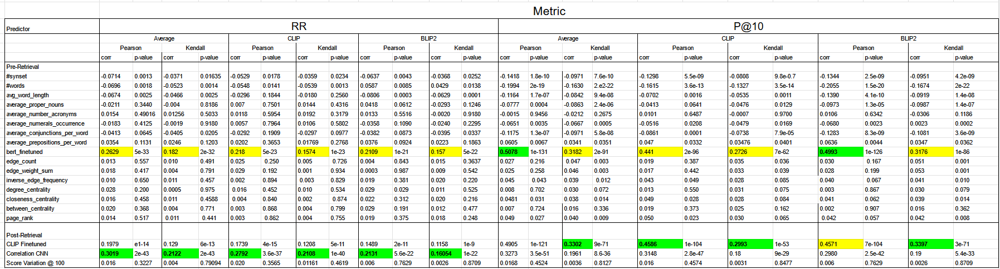
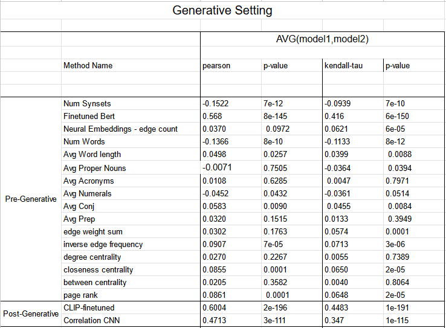

# PQPP 
This repository hosts the implementation and dataset for the scientific paper "PQPP: A Joint Benchmark for Text-to-Image Prompt and Query Performance Prediction".

## Table of contents 
- [PQPP: A Joint Benchmark for Text-to-Image Prompt and Query Performance Prediction](#pqpp)
  - [📝 Table of Contents ](#-table-of-contents)
  - [About ](#about-)
  - [Note](#note)  
  - [Dataset Description](#dataset-description)
  - [Project Structure](#project-structure)
  - [Getting Started ](#getting-started)
    - [Installing Prerequisites ](#prereqs)
  - [Usage ](#usage-)
    - [Retrieval Models ](#retrieval-models)
    - [Prediction Models ](#prediction-models) 
  - [Benchmark](#benchmark)
    - [Retrieval](#benchmark-ret) 
    - [Generative](#benchmark-gen) 

  - [⛏️ Developed with ](#️developed-with)
  - [Citation ](#citation-)
  - [🎉 Acknowledgements ](#acknowledgement)

## About 
This repository hosts the annotated dataset and the implementations of the prediction models described in the original paper.
This file also hosts the extended benchmark, including models which did not pass a minimum correlation threshold of 0.1.

We add instructions and full code in order to allow other researchers to easily replicate our research or validate our approach. You can find instructions for installation and training models.
We provide ground truth data for both generative and retrieval formats in order to facilitate integrations within your own code.

## Note 
If you are interested to conduct your own research on the dataset (any of the retrieval/generative setting) without understanding our code or models, then you can simply access the dataset inside \dataset\ground_truth.csv, and you can download the generated images and the groundtruth image at https://fmiunibuc-my.sharepoint.com/:u:/g/personal/radu_ionescu_fmi_unibuc_ro/Eb0peYyLDVRNn0EPeY7ZwKUBAd4Yt-Zs_PtEpc-DmQ0P4A?e=oIflTJ.

## Dataset Description 
Our dataset consists of two major parts:

        1. ground_truth.csv (containing MS COCO image id, p@10 /RR scores for retrieval setting, and the score for the generative setting )
        2. image folder ( contains the SDXL/GLIDE generated images alongside the original MS COCO image).
    
The image folder has the following structure:

        images\
            {IMG_ID_1}\
                \image_4.png - Image Generated by SDXL 
                \image_5.png - Image Generated by SDXL 
                \image_6.png - Ground Truth, Original MS-COCO Image
                \image_7.png - Image Generated by GLIDE
                \image_8.png - Image Generated by GLIDE
            {IMG_ID_2}\
            .
            .
            .        
            {IMG_ID_N}\

The suffies _4, _5 denote generation by SDXL.

THe suffix _6 denote the MS-COCO dataset.

The suffixes _7,_8 denote generation by GLIDE.

## Project structure 

    The project is structured as following:

    \PQPP
        \dataset - folder containing the annotated dataset
            \ all_users_ann_new.csv - Original generative setting annotations. Anonymized file
            \ avg_scores_mrr.pickle - Average RR for each query in the retrieval setting.
            \ avg_scores_p10.pickle - Average P@10 for each query in the retrieval setting.
            \ best_captions_df.pickle - File containing extra information about each query caption
            \ ground_truth.csv - Centralized ground truth file. This is the file to use if you plan to train new models or study the results in a "clean" method.
            \ gt_for_generative_all_models.csv - Score for each query in the generative seetting as described in the paper.
            \ merged_retrieval_gt.pickle - File containing the ground truth image matches for the retrieval setting.
            \ train_examples_new.pickle - File containing annotation for automated retrieval model training
            \ val_examples_new.pickle - File containg validation split 
            \ test_examples_new.pickle
        \pipelines - folder containing scripts to generate images for the generative setting
        \predictors - folder containing performance predictors as described in the paper
            \ correlation_cnn - Contains the CNN-based approach inspired by Sun. et al
            \ finetuned_bert - Contains the finetuned bert model training script
            \ finetuned_clip - Contains the finetuned clip model trainig script described in our research
            \ neural_embeddings - Contains the implementation of Arabzadeh et al.
            \ query_drift - Contains script to implement query drift.
            \ score-varation - Contains the score-variation deadline
        \retrieval_model_annotations - folder containing scripts to kickstart annotation process for retrieval and train automatic retrieval groundtruth computation
        \retrieval_models - folder containg scripts to perform text-to-image- search
    
## Getting started 

### Installing Pre-requisites 
In order to run our models you will need to install the requirements found in requirements.txt

    pip install -r requirements.txt

## Usage 

### Retrieval Models 

The retrieval models can be found at:

    \retrieval_models
        \clip
            \clip_retrieval.py - CLIP Retrieval Run. Saves Image ids returned.
            \save_clip_scores.py - CLIP Retrieval Run. Saves the scores for the retrieval.
            \generate_clip_embeddings.py - Generates CLIP embeddings for the MS-COCO dataset
            \generate_clip_query_embeddings.py - Generates CLIP embeddings for queries

        \blip2
            \blip2_retrieval.py - BLIP-2 Retrieval Run. Saves Image ids returned.
            \save_blip2_scores.py - BLIP-2 Retrieval Run. Saves the scores for the retrieval.
            \generate_blip2_embeddings.py - Generates BLIP-2 embeddings for the MS-COCO image dataset
            \generate_blip2_query_embeddings.py - Generates BLIP-2 embeddings for queries

        \compute_scores.py - Allow the computation of P@10 and RR scores.
        \generate_average_scores.py - Computes the average of the computed scores (CLIP/BLIP-2)

### Predictions models 

Prediction models can be found at:

    \predictors
        \correlation_cnn
        \finetuned_clip
        \neural_embeddings
        \score-variation

## Complete benchmark 

### Retrieval 

### Generative 

## Developed with 

Annotation platform was developed with the following technologies:

Research was conducted using the following technologies:
    

OpenAI CLIP Model
https://github.com/openai/CLIP

OpenAI GLIDE Model
https://github.com/openai/glide-text2im

Salesforce BLIP-2 Model
https://github.com/salesforce/LAVIS/tree/main/projects/blip2

StabilityAI SDXL Model
https://huggingface.co/stabilityai/stable-diffusion-xl-base-1.0

## 🎉 Acknowledgements 
We thank all researchers for their implication and expertise and annotators for their incredible work amounting to our dataset.
Thank you once again!

## License
[MIT](https://choosealicense.com/licenses/mit/)